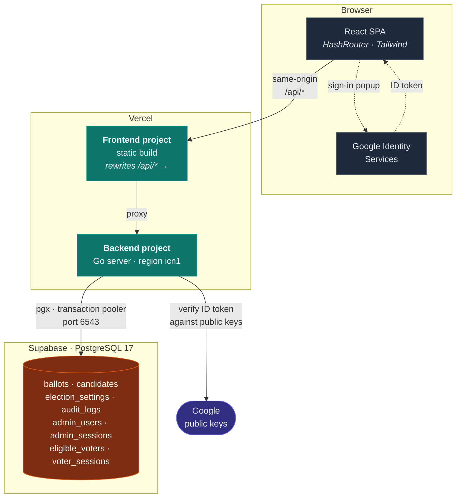
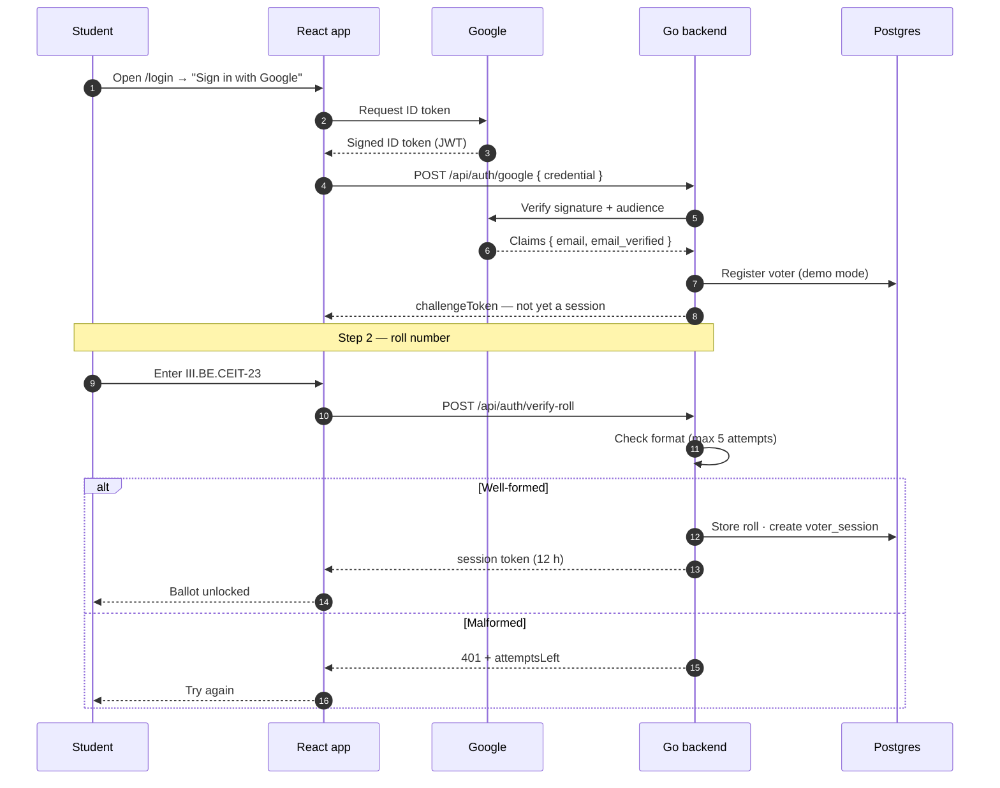
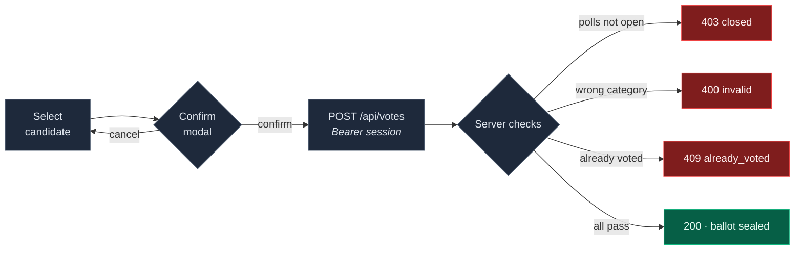
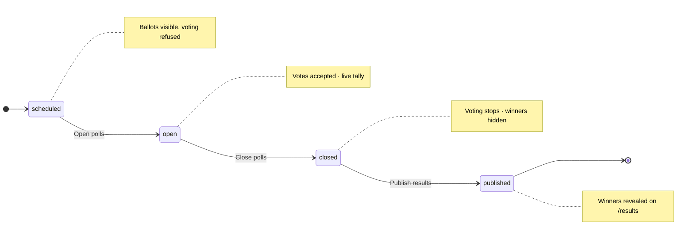

# MTU Voting Awards

Voting system for the Myanmar Technological University fresher welcome — students sign in with Google, confirm their roll number, and cast one ballot in each of six award categories. Organisers control the election from an admin console and reveal the winners live.

**Live:** https://welcome-voting-mtu-azure.vercel.app

| | |
|---|---|
| Frontend | React 19 · TypeScript · Vite 8 · Tailwind v4 |
| Backend | Go 1.27 · `net/http` · `pgx` |
| Database | Supabase (PostgreSQL 17) |
| Auth | Google Identity Services (voters) · bcrypt + session tokens (admins) |
| Hosting | Vercel (`icn1` — Seoul, next to the database) |

---

## Demo credentials

> [!WARNING]
> These are **demo credentials in a public repository**. Rotate the admin password and switch to a real voter roll before running an actual election. See [Going live](#going-live).

**Admin**

| Field | Value |
|---|---|
| URL | https://welcome-voting-mtu-azure.vercel.app/#/login → **🛡️ Admin** |
| Email | `admin@mtu.edu.mm` |
| Password | `MTUfresher&2026` |

**Voter** — any Google account works in demo mode. Sign in, then enter a roll number matching the format:

```
<year>.<degree>.<department>-<number>
```

| Valid | Invalid |
|---|---|
| `III.BE.CEIT-23` | `MTU-2026-0001` |
| `I.BE.CEIT-21` | `III.BE.CEIT` |
| `II.BE.Che-1` | `3.BE.CEIT-23` |
| `IV.BE.Me-9` | `III.BE.CEIT-23x` |

Only the *shape* is checked — there is no student list to be on. Roman numeral year, 1–6 letter degree, 1–15 letter department, 1–5 digit number, any case.

---

## Architecture



Frontend and API share **one origin** — `/api/*` is rewritten to the Go service — so there are no CORS preflights and only one origin to authorise in Google Cloud Console.

---

## Voter flow

Two steps. Google proves the email; the roll number identifies the student.



Casting a vote:



> Voter identity comes from the **session token**, never the request body. Anything the client sends for `voterId` / `voterEmail` is ignored.

---

## Election lifecycle

The admin drives the whole evening from the Controls tab.



Enforced **server-side** — a request outside `open` is rejected with `403` regardless of what the UI shows.

---

## Award categories

| | Category | Nominees |
|---|---|---|
| 👑 | King | male |
| ♛ | Queen | female |
| ✨ | Best Style | female |
| 🎓 | Smartest | male |
| 🤵🏻 | Mr. Popular | male |
| 🌟 | Miss Popular | female |

One vote per category per voter, enforced by a `UNIQUE (voter_id, category)` constraint in Postgres. Switching the election type to `major` hides the two Popular categories.

---

## API

Base path `/api`. Admin routes need `Authorization: Bearer <admin token>`, voter routes a voter token.

| Method | Endpoint | Access | Purpose |
|---|---|---|---|
| `GET` | `/health` | public | Liveness + database check |
| `GET` | `/election` | public | Status and type |
| `GET` | `/candidates` | public | Nominee list |
| `GET` | `/tally` | public | Aggregate counts — **no voter PII** |
| `POST` | `/auth/google` | public | Step 1 — verify Google ID token |
| `POST` | `/auth/verify-roll` | public | Step 2 — roll number → session |
| `POST` | `/auth/logout` | voter | Revoke voter session |
| `POST` | `/votes` | **voter** | Cast one ballot |
| `GET` | `/my-ballots` | **voter** | Own votes only |
| `POST` | `/admin/login` | public | bcrypt check → admin token |
| `POST` | `/admin/logout` | admin | Revoke admin session |
| `GET` `DELETE` | `/ballots` | **admin** | Full ledger · reset all votes |
| `GET` `POST` | `/audit` | **admin** | Audit trail |
| `POST` `PUT` | `/candidates` | **admin** | Create · update nominees |
| `PUT` | `/election` | **admin** | Change status or type |

The full ledger carries voter names and emails, so it is admin-only; public pages read `/tally` instead.

---

## Running locally

**Prerequisites:** Node 24+, Go 1.27+, a Supabase project, a Google OAuth client ID.

```bash
git clone https://github.com/htethtet42/welcome-voting-mtu.git
cd welcome-voting-mtu
npm install
```

Create `backend/.env`:

```env
DATABASE_URL=postgresql://postgres.<ref>:<password>@aws-0-<region>.pooler.supabase.com:6543/postgres
GOOGLE_CLIENT_ID=<id>.apps.googleusercontent.com
PORT=8081
```

Create `.env`:

```env
VITE_API_URL=http://localhost:8081/api
VITE_GOOGLE_CLIENT_ID=<id>.apps.googleusercontent.com
```

Apply the schema and seed nominees:

```bash
cd backend
psql "$DATABASE_URL" -f schema.sql
psql "$DATABASE_URL" -f schema_auth.sql
psql "$DATABASE_URL" -f schema_voters.sql
psql "$DATABASE_URL" -f seed_candidates.sql
```

Create an admin:

```bash
go run ./cmd/hashpw 'your-password'
psql "$DATABASE_URL" -c "INSERT INTO admin_users (email, name, password_hash) VALUES ('admin@mtu.edu.mm','Event Admin','<hash>');"
```

Run both:

```bash
cd backend && set -a && . ./.env && set +a && go run .   # :8081
npm run dev                                              # :5173
```

> The dev port is pinned to **5173** with `strictPort`. Google matches origins exactly, so a silent fallback to another port breaks sign-in with `origin_mismatch`.

Add `http://localhost:5173` to **Authorized JavaScript origins** in Google Cloud Console. Leave redirect URIs empty — Identity Services does not redirect.

---

## Deploying

Two Vercel projects; the frontend rewrites `/api/*` to the backend.

```bash
cd backend && vercel --prod    # Go service
cd ..      && vercel --prod    # React app
```

Environment variables live in **Vercel project settings**, never in a local `.env` — `.vercelignore` blocks those from being uploaded, because Vite would otherwise inline `localhost` into the production bundle.

| Project | Variables |
|---|---|
| Backend | `DATABASE_URL`, `GOOGLE_CLIENT_ID`, optional `VOTER_ELIGIBILITY` |
| Frontend | `VITE_API_URL=/api`, `VITE_GOOGLE_CLIENT_ID` |

Add the deployed URL to Google's Authorized JavaScript origins.

---

## Going live

This is a demo. Before a real election:

- [ ] **Rotate the admin password** — it is published above. `go run ./cmd/hashpw` and update `admin_users`.
- [ ] **Switch to a real voter roll** — set `VOTER_ELIGIBILITY=roll` and import the registrar's list (`backend/import_roll.sql`). Emails must be lowercase.
- [ ] **Replace placeholder nominees** — `src/data.ts` and `seed_candidates.sql` contain stand-ins.
- [ ] **Publish the OAuth consent screen** — Testing mode caps at 100 users. Publishing needs no Google verification for `openid`/`email`/`profile`.
- [ ] **Reset the election** to `scheduled`.

> [!IMPORTANT]
> In demo mode the roll number is **not** a second factor — anyone can invent a conforming value. Identity rests on the Google account, which enforces one vote per category per person, but someone with several Gmail accounts can vote several times. `VOTER_ELIGIBILITY=roll` closes this.

### Known gaps

- **Livestream page is a mockup** — the YouTube video ID is hardcoded `null`, chat messages are a scripted array on a timer, and the viewer count is a random walk.
- **No auto-deploy** — deployments are manual until the repository is connected to Vercel.
- The countdown on the ballot uses a fixed date rather than the election's `closes_at`.

---

## Repository layout

```
├── src/                    React app
│   ├── context/            Auth + election state
│   ├── pages/              Landing · Login · Vote · Results · Livestream · Admin
│   └── lib/api.ts          API base URL + token helpers
├── backend/
│   ├── main.go             Routing · candidates · election · audit
│   ├── auth.go             Admin login · session middleware
│   ├── voterauth.go        Google OAuth · roll verification
│   ├── public.go           Tally · own-ballot endpoints
│   ├── rollformat.go       Roll number format + eligibility mode
│   ├── schema*.sql         Database schema
│   └── cmd/hashpw/         bcrypt hash generator
└── TODO.md                 Outstanding work
```
